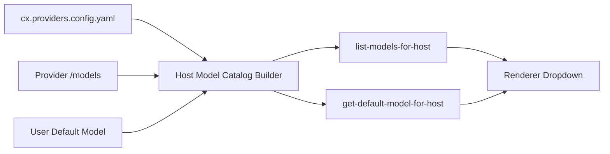

# Codex Desktop 自定义模型列表重构方案

## 目标

让 `cx` 能稳定支持桌面端模型下拉列表展示并切换第三方模型，至少覆盖：

- `qwen3.7-max`
- `qwen3.7-plus`

同时满足这几个约束：

- 不依赖手改桌面 App 的前端打包产物
- 不要求外部 launcher 注入 `HOME`
- 模型列表里显示真实 `model id`，而不是被 UI 映射回 `GPT-5`
- provider 切换后，对话/项目隔离策略可控，而不是隐式耦合

## 现状结论

这次验证表明，单改 `config.toml` 只能影响“实际请求走哪个 provider / model”，不能保证桌面端模型下拉列表正确展示。

桌面端列表实际由三层信息合成：

1. Statsig 下发的 `available_models` / `default_model`
2. host 侧 `list-models-for-host` 返回的模型清单
3. renderer 内部的过滤与显示逻辑

所以 `cx` 如果只做 provider 适配，而不接管“模型列表来源”和“显示名策略”，最终就会出现这几类问题：

- 能发到 Qwen，但下拉列表空白
- 能发到 Qwen，但对话头部仍显示 `GPT-5`
- 配置生效，但 UI 只认 OpenAI 预设模型

## 这次 POC 证明了什么

我们通过直接改 `Codex2.app` 内部 renderer 资源，已经证明以下目标可以做到：

- 下拉列表显示 `qwen3.7-max` 和 `qwen3.7-plus`
- 默认模型落到 `qwen3.7-plus`
- 不依赖外部启动器
- `CODEX_HOME` 可固化到 `~/.config/cx/codex2`

对应的关键 renderer 文件是：

- `webview/assets/model-queries-DmmJqKhY.js`
- `webview/assets/model-list-filter-BOpqDcyc.js`
- `webview/assets/models-and-reasoning-efforts-Ct6D5g-X.js`

这说明问题根因不是 provider 兼容性本身，而是“桌面端 UI 的模型元数据管道没有向第三方 provider 开放”。

## 建议的 cx 重构方向

### Phase 1: 抽象模型目录来源

在 `cx` 内引入统一的 `ModelCatalogSource`，把模型列表来源拆成两类：

- provider 静态配置
- runtime 动态发现

建议最终合并成统一结构：

```ts
type CustomModelDescriptor = {
  id: string;
  display_name?: string;
  provider: string;
  owned_by?: string;
  reasoning_efforts?: string[];
  hidden?: boolean;
  available?: boolean;
  default?: boolean;
};
```

输入来源建议支持：

- `~/.config/cx/cx.providers.config.yaml`
- provider 返回的 `/models`
- 本地补丁目录或生成缓存

### Phase 2: 接管 host -> renderer 的模型清单协议

不要让 renderer 直接依赖 OpenAI 预设列表。

建议让 host 暴露一个稳定接口，例如：

- `list-models-for-host`
- `get-default-model-for-host`
- `get-model-reasoning-efforts`

其中 `list-models-for-host` 返回的就应该已经是“可直接显示”的最终列表，而不是让 renderer 再猜一次。

关键点：

- `display_name` 默认直接回落到 `id`
- 第三方 provider 的模型默认 `hidden = false`
- `default model` 应由 host 明确给出

### Phase 3: renderer 改成“展示 host 真相”

renderer 层只做 UI，不再维护 OpenAI-only 的模型知识。

最少要做到：

1. 用 `display_name ?? id` 渲染
2. 对未知 provider 不做“映射回 GPT-*”
3. 如果 host 给了模型列表，就不要再被 Statsig `available_models` 覆盖掉
4. 如果 host 给了默认模型，就不要再 fallback 到固定 `gpt-*`

### Phase 4: provider namespace 与会话归属显式化

这次排查里一个很明显的现象是：provider 切换会影响会话/项目可见性，说明当前存在 provider 级别的隐式命名空间。

`cx` 应把这件事显式设计出来：

- 会话按 `profile / provider / workspace` 归档
- UI 上能看到当前 profile
- 切换 provider 时，不应让用户误以为“数据丢了”

### Phase 5: 配置与桌面端解耦

建议把桌面端 profile 固化为：

- `HOME` 保持真实用户目录
- `CODEX_HOME` 指向 profile 目录

例如：

- `~/.config/cx/codex2`

原因：

- 改 `HOME` 会放大 keychain、session、插件缓存、副作用排查难度
- 只改 `CODEX_HOME` 就足够隔离 Codex 的配置、状态和数据库

## 推荐的数据流



## 最小可交付版本

第一版不必追求通用插件体系，先把下面这条链打通即可：

1. `dashscope` provider 配置里显式声明 `qwen3.7-max` 和 `qwen3.7-plus`
2. host 把它们返回给 renderer
3. renderer 直接显示 `model id`
4. 默认模型可设为 `qwen3.7-plus`

## 验收标准

- 模型下拉列表可见 `qwen3.7-max`、`qwen3.7-plus`
- 新建对话时，头部显示真实模型 id
- 不需要外部 launcher
- 不需要篡改 `HOME`
- 切换 profile 后，会话隔离行为可解释、可预期

## 迁移建议

先把这次硬编码 POC 当作“反向规格说明”，再在 `cx` 里补正式实现。

也就是说，`cx` 的重构目标不是“继续 patch 打包后的 JS”，而是把这次 patch 所接管的 3 个职责，前移成正式能力：

- 模型列表来源
- 默认模型决策
- 显示名策略
